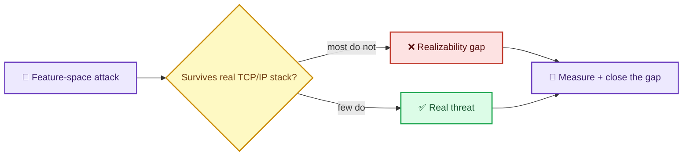
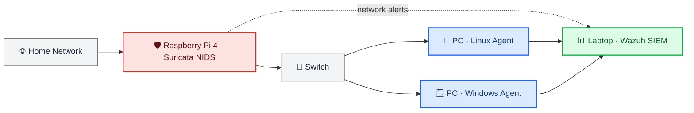

# Nazmus Sakib

---

## Research

**Adversarial robustness in ML-based Network Intrusion Detection Systems.**

Most published ML-NIDS robustness numbers are tested against feature-space attacks that cannot survive a real network stack. I build reproducible evaluation frameworks using realistic gray-box adversary models and problem-space constraints — so a claimed "attack" must prove it could actually happen on the wire.

- **Datasets:** UNSW-NB15 · CICIDS2017 · NSL-KDD
- **Core idea:** the *realizability gap* between math-space and packet-space attacks
- **Method:** gray-box threat taxonomy + problem-space validation + adaptive co-evolution benchmark

---

## Featured Work

| Project | What it is | Status |
|---|---|---|
| **Wazuh SOC Home Lab** | 5-node SIEM with real attack simulation, custom detection rules, incident playbooks. | Building |
| **IDS Edge Compression** | Knowledge distillation + pruning + INT8 quantization for ML intrusion detection on edge. NF-UQ-NIDS-v2, 72.7M flows. | IEEE Access — under review |
| **ML-Based IDS** | Conference work on ML intrusion detection. | ICCIT 2026 — submitting |

---

## Toolkit

**Domains:** Adversarial ML · SIEM & Log Analysis · Network Intrusion Detection · Threat Detection Engineering · Model Compression

---

## Certifications

- Google Cybersecurity Professional Certificate
- EC-Council Network Defense Essentials
- Linux for LFCA (LearnQuest)
- Stanford / DeepLearning.AI — Supervised Machine Learning

---

## Currently

- Building out the Wazuh SOC lab to a full detection-engineering portfolio
- Writing my thesis framework on problem-space adversarial NIDS evaluation
- Polishing two papers toward submission
- Final-year BSc CSE @ American International University-Bangladesh

---

### Contribution Snake

### GitHub Activity

---

## Let's Connect

I'm looking for an **IT / Security / ML internship** (Dhaka, Bangladesh). If you work on detection, threat intel, or applied ML — let's talk.

Adversarial ML for NIDS · The attack has to work on a real network, not just on paper.

