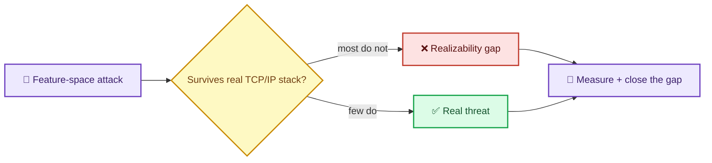
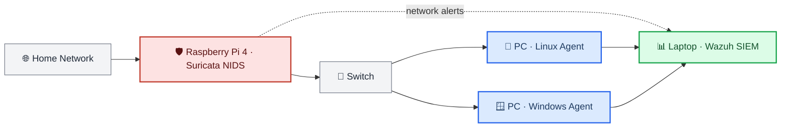
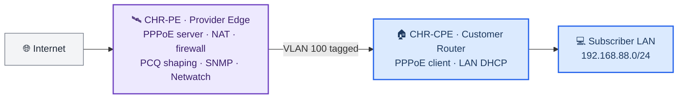

# Nazmus Sakib

---

## Research

**Adversarial robustness in ML-based Network Intrusion Detection Systems.**

Most published ML-NIDS robustness numbers are tested against feature-space attacks that cannot survive a real network stack. I build reproducible evaluation frameworks using realistic gray-box adversary models and problem-space constraints — so a claimed "attack" must prove it could actually happen on the wire.

```mermaid
flowchart LR
    accTitle: The Realizability Gap in Adversarial NIDS
    accDescr: Feature-space attacks succeed mathematically, but most fail when forced through real TCP/IP constraints. This research measures and closes that gap.

    attack["🧮 Feature-space attack"] --> gate{"Survives real TCP/IP stack?"}
    gate -->|"most do not"| gap["❌ Realizability gap"]
    gate -->|"few do"| real["✅ Real threat"]
    gap --> work["🔬 Measure + close the gap"]
    real --> work

    classDef q fill:#fef9c3,stroke:#ca8a04,stroke-width:2px,color:#713f12
    classDef bad fill:#fde2e2,stroke:#c0392b,stroke-width:2px,color:#5a1212
    classDef good fill:#dcfce7,stroke:#16a34a,stroke-width:2px,color:#14532d
    classDef focus fill:#ede9fe,stroke:#6f42c1,stroke-width:2px,color:#3b1f6b

    class gate q
    class gap bad
    class real good
    class attack,work focus
```

- **Datasets:** UNSW-NB15 · CICIDS2017 · NSL-KDD
- **Core idea:** the *realizability gap* between math-space and packet-space attacks
- **Method:** gray-box threat taxonomy + problem-space validation + adaptive co-evolution benchmark

---

## Featured Work

| Project | What it is | Status |
|---|---|---|
| **[MikroTik ISP Access Lab](https://github.com/sakib2588/mikrotik-isp-lab)** | Two-router RouterOS lab reproducing a BD ISP access network: PPPoE subscriber auth, NAT, stateful firewall, tagged VLAN 100, PCQ per-subscriber shaping, SNMP polling, Netwatch uplink watchdog. Every claim traces to a command that was actually run. | Phase 1 complete (10/20 tasks) |
| **[Wazuh SOC Home Lab](https://github.com/sakib2588/wazuh-soc-home-lab)** | 4-OS fleet (Pop!\_OS, Arch, Raspberry Pi, Windows) reporting to a central Wazuh SIEM, Suricata NIDS on the Pi, 7 custom detection rules proven against live attack simulation. | Phases 3-4 complete |
| **IDS Edge Compression** | Knowledge distillation + pruning + INT8 quantization for ML intrusion detection on edge. NF-UQ-NIDS-v2, 72.7M flows. | IEEE Access — under review |
| **ML-Based IDS** | Conference work on ML intrusion detection. | ICCIT 2026 — submitting |

```mermaid
flowchart LR
    accTitle: Wazuh SOC Home Lab Architecture
    accDescr: A five-node security monitoring lab. A Raspberry Pi runs Suricata network detection while agents on Linux and Windows hosts report to a central Wazuh SIEM server.

    net["🌐 Home Network"] --> rpi["🛡️ Raspberry Pi 4 · Suricata NIDS"]
    rpi --> sw["🔀 Switch"]
    sw --> linux["🐧 PC · Linux Agent"]
    sw --> win["🪟 PC · Windows Agent"]
    rpi -. "network alerts" .-> siem["📊 Laptop · Wazuh SIEM"]
    linux --> siem
    win --> siem

    classDef sensor fill:#fde2e2,stroke:#c0392b,stroke-width:2px,color:#5a1212
    classDef agent fill:#dbeafe,stroke:#2563eb,stroke-width:2px,color:#1e3a5f
    classDef core fill:#dcfce7,stroke:#16a34a,stroke-width:2px,color:#14532d
    classDef infra fill:#f3f4f6,stroke:#6b7280,stroke-width:1px,color:#1f2937

    class rpi sensor
    class linux,win agent
    class siem core
    class net,sw infra
```

```mermaid
flowchart LR
    accTitle: MikroTik ISP Access Lab
    accDescr: A provider-edge router runs a PPPoE server on a tagged VLAN. A customer router has no internet path of its own and must authenticate a PPPoE session to reach the internet, which proves the access network is real rather than shortcut.

    net["🌐 Internet"] --> pe["🛰️ CHR-PE · Provider Edge<br/>PPPoE server · NAT · firewall<br/>PCQ shaping · SNMP · Netwatch"]
    pe -- "VLAN 100 tagged" --> cpe["🏠 CHR-CPE · Customer Router<br/>PPPoE client · LAN DHCP"]
    cpe --> lan["💻 Subscriber LAN<br/>192.168.88.0/24"]

    classDef edge fill:#ede9fe,stroke:#6f42c1,stroke-width:2px,color:#3b1f6b
    classDef cust fill:#dbeafe,stroke:#2563eb,stroke-width:2px,color:#1e3a5f
    classDef infra fill:#f3f4f6,stroke:#6b7280,stroke-width:1px,color:#1f2937

    class pe edge
    class cpe,lan cust
    class net infra
```

---

## Toolkit

**Domains:** Adversarial ML · SIEM & Log Analysis · Network Intrusion Detection · Threat Detection Engineering · Model Compression

**Networking:** PPPoE access networks · VLANs & trunking · routing & NAT · stateful firewalls · QoS / PCQ shaping · SNMP monitoring

---

## Certifications

### Cisco Networking Academy — CCNA course track (complete, Aug 2026)

&nbsp;&nbsp;
&nbsp;&nbsp;

| Course badge | Covers | Where I applied it |
|---|---|---|
| **[ITN](https://www.credly.com/badges/3a056378-cca0-47da-82e9-16a7086a0fbd/public_url)** — Introduction to Networks | IPv4/IPv6 addressing, subnetting, Ethernet, the protocol stack, Cisco IOS basics | Addressing plan and VLAN design in the [MikroTik ISP lab](https://github.com/sakib2588/mikrotik-isp-lab) |
| **[SRWE](https://www.credly.com/badges/749440df-451c-4607-b923-89590976b371/public_url)** — Switching, Routing, and Wireless Essentials | VLANs, trunking, STP, EtherChannel, inter-VLAN routing, DHCP, WLAN, first-hop redundancy | Tagged VLAN 100 access network and DHCP-served subscriber LAN in the same lab |
| **[ENSA](https://www.credly.com/badges/5de94878-6906-4620-a076-efd961cf3d82/public_url)** — Enterprise Networking, Security, and Automation | OSPF, ACLs, NAT, WAN technologies, QoS, network security, SNMP, automation | Stateful firewall, masquerade NAT, PCQ shaping and SNMP polling on the provider edge |

All three completed through Cisco Networking Academy and issued 9 August 2026 — click any badge to verify it on Credly. These are course badges, not the CCNA 200-301 certification — that exam is booked for 14 September 2026.

### Other

- [Google Cybersecurity Professional Certificate](https://www.credly.com/badges/1c5e3389-768d-44a6-92e8-c92211e55627/public_url) — verified badge
- [EC-Council Network Defense Essentials](https://www.coursera.org/account/accomplishments/verify/UJ19ZORDK6KA) — verified
- [Stanford / DeepLearning.AI — Supervised Machine Learning](https://www.coursera.org/account/accomplishments/verify/AZCMFN532NYG) — verified
- [Linux for LFCA (LearnQuest) — 4-course Specialization](https://coursera.org/verify/specialization/WIYTXTEY3JMX) — verified
- [Solving Problems with Creative and Critical Thinking (IBM)](https://www.coursera.org/account/accomplishments/verify/EELUDQREPQ8C) — verified

---

## Currently

- Phase 2 of the MikroTik ISP lab: OSPF, BGP, MPLS, RADIUS-backed subscriber auth
- Preparing for CCNA 200-301 (exam booked 14 September 2026)
- Writing my thesis framework on problem-space adversarial NIDS evaluation
- Polishing two papers toward submission
- Final-year BSc CSE @ American International University-Bangladesh

---

### Contribution Snake

### GitHub Activity

---

## Let's Connect

I'm looking for a **NOC / network engineering / security internship or entry role** (Dhaka, Bangladesh). If you run an ISP access network, a NOC, or a detection team — let's talk. I build the lab before I claim the skill.

Adversarial ML for NIDS · The attack has to work on a real network, not just on paper.

